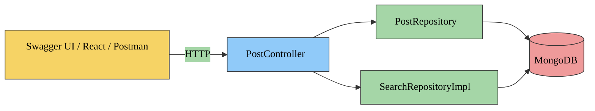

<p align="center">
  
</p>
<p align="center">
  
  
  
  
</p>

---
# 🚀 JobBoardX – A Spring Boot + MongoDB Job Listing API

> _"Built from curiosity, refined with best practices."_  
> I once came across a company’s career page on LinkedIn and wondered: **how do they manage and serve hundreds of job listings behind the scenes?**  
> That curiosity became this project — a hands-on backend exploration into modern, scalable API design using **Spring Boot** and **MongoDB**.

---

## 🧠 Project Overview

**JobBoardX** is a production-grade REST API built with **Spring Boot** and **MongoDB** that demonstrates how job-posting platforms handle:
- data storage and retrieval,
- paginated listings,
- search queries,
- validation,
- and clean error reporting.

It’s intentionally simple — yet designed using **industry-standard backend patterns**:
- **Controller → Repository → Model** separation
- **Pagination & Sorting** (Spring Data)
- **Input Validation** (Bean Validation)
- **Global Exception Handling**
- **Interactive API Docs via Swagger UI**

---

## 🏗️ Architecture




---

## ⚙️ Tech Stack

| Layer | Technology |
|-------|-------------|
| **Backend Framework** | Spring Boot (v2.5.7) |
| **Database** | MongoDB (Atlas / Local) |
| **Language** | Java 17 |
| **API Documentation** | Swagger 2 (Springfox) |
| **Build Tool** | Maven |
| **Validation** | Hibernate Validator (JSR-303) |
| **Error Handling** | Custom `@ControllerAdvice` Handler |

---

## 🚀 Features

✅ **1. MongoDB Integration**  
Connects seamlessly to a cloud or local MongoDB instance using `application.properties`.

✅ **2. RESTful Endpoints**  
CRUD-style routes for job listings with clean, descriptive URLs.

✅ **3. Pagination & Sorting**  
Efficiently returns data slices via `Pageable`.  
Example:
GET /api/posts/page?page=0&size=5&sort=exp,desc

✅ **4. Full-Text Search**  
Uses MongoDB Atlas Search to find posts by keywords in real time:
GET /api/posts/{text}

✅ **5. Input Validation**  
Rejects malformed requests automatically (e.g., empty fields, negative experience).

✅ **6. Global Exception Handling**  
Standardized, developer-friendly error responses in json format


✅ **7. Swagger UI**
👉 [http://localhost:8080/swagger-ui.html](http://localhost:8080/swagger-ui.html)

### 🔍 **API Endpoints Summary**

| **Method** | **Endpoint**           | **Description**                    |
|-------------|------------------------|------------------------------------|
| **GET**     | `/api/posts`           | Fetch all job posts                |
| **GET**     | `/api/posts/page`      | Fetch paginated job posts          |
| **GET**     | `/api/posts/{text}`    | Search job posts by keyword        |
| **POST**    | `/api/post`            | Add a new job post _(validated)_   |

---

## 🧩 **Example Walkthrough**

Below are some snapshots showing how the JobBoardX API works — from data insertion to validation and error handling.

---

### ⚙️ **Swagger UI Overview**


---

### 🧾 **Example Requests**

#### 🟢 Add Data to MongoDB
Demonstrates adding a new job post through the `/api/post` endpoint.


---

#### 📋 Get All Job Posts
Fetches all available job listings stored in the MongoDB collection.


---

#### 🔍 Search Job Posts by Text
Searches for posts containing specific text using MongoDB Atlas Search.


---

#### 📄 Pagination in Action
Displays how results are neatly paginated and structured after adding the pagination feature.


---

#### ✅ Input Data Validation
Demonstrates field-level validation in action when invalid or incomplete data is submitted.


---

#### ⚠️ Global Exception Handling
Shows how structured, user-friendly error messages (with field-level details and status codes) are returned via the global exception handler.


---

> 🧠 These examples illustrate how **clean API design**, **validation**, and **structured error handling** turn a simple project into a **production-ready backend system**.

## 🧩 **How to Run Locally**

### 1️⃣ Clone the Repository
```bash
git clone https://github.com/<your-username>/jobboardx.git
cd jobboardx
```
### 2️⃣ Configure MongoDB

In src/main/resources/application.properties, update your credentials:
```bash
spring.data.mongodb.uri=mongodb+srv://<username>:<password>@cluster.mongodb.net/
spring.data.mongodb.database=JobListing
server.port=8080
```
### 3️⃣ Build and Run the Application
```bash
mvn clean install
mvn spring-boot:run
```
Once the application starts, open Swagger UI to explore the endpoints:
👉 [http://localhost:8080/swagger-ui.html](http://localhost:8080/swagger-ui.html)

### 🧠 ***Learning Goals***

Through this project, I gained a deep understanding of:

🧩 How backend frameworks map HTTP requests to Java methods

🗃️ How MongoDB schemas differ from traditional relational models

⚙️ How pagination and sorting enhance scalability

✅ How enterprise-grade systems enforce validation and consistent error handling

### 🧑‍💻 ***Future Enhancements***

 - Add DTO layer for cleaner API contracts

 - Implement JWT-based authentication for secured access

 - Build a React frontend dashboard to visualize paginated job posts

 - Containerize the app using Docker + Docker Compose

 - Deploy on AWS EC2 / Elastic Beanstalk for production hosting

### 🧭 ***Author***

👩‍💻 Dileep Kanumuri
Software Engineer | Full-Stack Developer | AI/ML Enthusiast

## 📚 References

This project was inspired and guided by the following resources:

- **🎥 YouTube Tutorial:**  
- [Spring Boot + MongoDB CRUD API](https://www.youtube.com/watch?v=kYiLzIiHVY8) by *Navin*  
  *I followed this tutorial as a base and later enhanced it with pagination, input validation, and a global exception handler.*

- **📘 Spring Boot Documentation:**  
  [Spring Boot Reference Guide](https://docs.spring.io/spring-boot/docs/2.5.7/reference/htmlsingle/)

- **🗃️ Spring Data MongoDB:**  
  [Spring Data MongoDB Docs](https://docs.spring.io/spring-data/mongodb/docs/current/reference/html/)

- **✅ Validation (JSR-303/380):**  
  [Spring Boot Validation Guide](https://docs.spring.io/spring-boot/docs/2.5.7/reference/htmlsingle/#boot-features-validation)

- **🧭 Swagger / Springfox:**  
  [Springfox Swagger 2.x Documentation](https://springfox.github.io/springfox/)

- **🔍 MongoDB Atlas Search:**  
  [MongoDB Atlas Search Documentation](https://www.mongodb.com/docs/atlas/atlas-search/)


  

